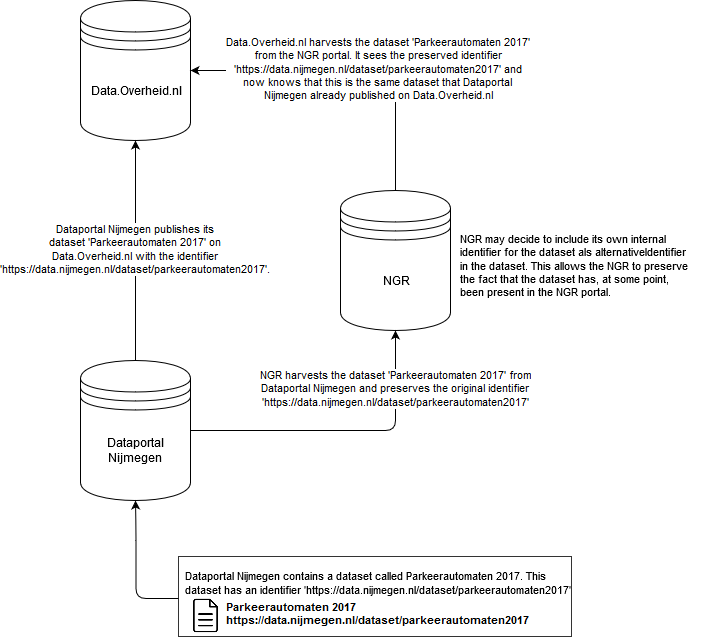
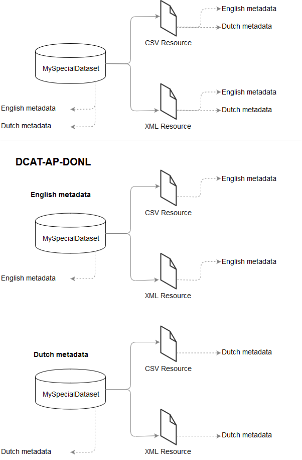

Workflow
===============================

Two aspects of the DCAT-AP-DONL 1.1 application profile deserve further elaboration, as they are a
considerable change from either DCAT-AP-DONL 1.0 or DCAT-AP-NL 1.1. This is done below.

Dataset identifier
-------------------------------

The value of a dataset identifier is the original identifier of the dataset. This value must be
preserved when this dataset moves across dataportals. This ensures that the dataset, regardless of
the dataportal it currently resides in, can always be uniquely identified. To communicate that a
dataset is or has been present in a dataportal, the dataportal may elect to include its own internal
identifier of the dataset as a part of the :code:`alternativeIdentifier` property.

This process is visualised below:

    Identifier workflow visualised

In the event that changes are made to a dataset that are not made by the original authority or
publisher, the identifier property is invalidated. At this point the value of the identifier
property is the identifier of the dataset that that dataportal currently maintains. In the above
example, should NGR make changes to the dataset, then the internal identifier that NGR maintains for
the dataset becomes the identifier of the new dataset.

Multilingual support
-------------------------------

DCAT-AP-DONL mandates that the metadata of a dataset is provided in only one language. In order to
provide metadata in multiple languages for a single dataset, the following steps must be taken.

First create the original dataset with metadata in a specific language:

.. code-block:: json

    {
        "identifier":         "http://mydata.portal.com/dataset/mijndataset1",
        "metadata_langugage": "http://publications.europa.eu/resource/authority/language/NLD",
        "title":              "Mijn dataset titel 1",
        "description":        "Mijn dataset omschrijving 1",
        ...
    }

Then, when wanting to support metadata in a secondary language, create a new dataset with the
metadata in the new language which references the original dataset:

.. code-block:: json

    {
        "identifier":         "http://mydata.portal.com/dataset/mijndataset1",
        "metadata_langugage": "http://publications.europa.eu/resource/authority/language/ENG",
        "title":              "My dataset 1",
        "description":        "My dataset description 1",
        "is_version_of":      "https://data.overheid.nl/datasets/mijndataset1",
        ...
    }

By declaring your dataset with the same identifier and stating that the new dataset is a version of
the original dataset you signal that the datasets are identical and that only the metadata is
different. Ensure that the different datasets have unique metadataLanguage properties.

A visual guide:

    Visualisation of multilingual support in DCAT-AP-DONL

In short: group all the resources with metadata in the same language under one dataset, which
metadataLanguage matches that of the resources. When the dataset becomes available in a new language
, create and maintain a separate dataset and resources for the new language. The actual accessURLs
and downloadURLs can be the same across both datasets.
